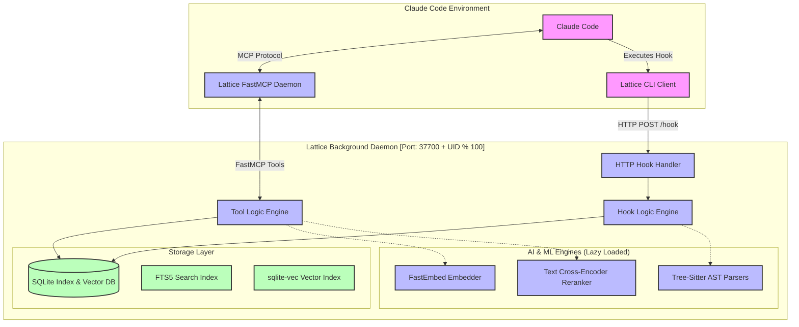
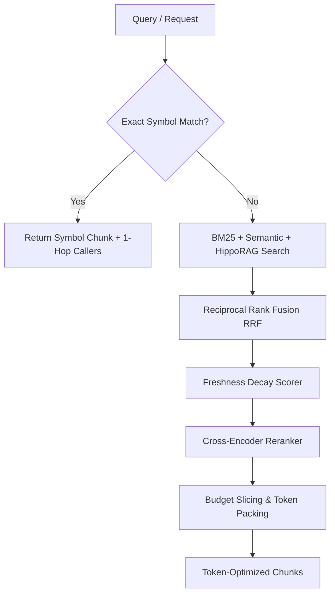

# Lattice Python Architecture

`lattice-python` is a token-efficient, freshness-aware hybrid retrieval and memory plugin for Claude Code. It implements a local-only codebase index, a semantic graph, and MCP tools integrated with Claude Code’s lifecycle hooks.

---

## 1. High-Level System Architecture

Lattice uses a dual-process architecture consisting of a **Thin CLI Client** and a **Persistent Background Daemon (FastMCP + HTTP)**. This ensures that Claude Code hook executions are extremely fast, keeping latency low by offloading heavy ML model loads and DB transactions to the persistent daemon.



---

## 2. Data & Storage Layer

Lattice uses a unified SQLite database containing full-text search capabilities and vector search support (via `sqlite-vec`). The schema is defined as follows:

```sql
-- Core chunks storage
CREATE TABLE chunks (
    id TEXT PRIMARY KEY,               -- 16-character SHA-256 hash prefix of content/metadata
    heading TEXT NOT NULL,             -- Human-readable chunk title (e.g. file_path:start-end)
    body TEXT NOT NULL,                -- Code or note body text
    source TEXT NOT NULL,              -- 'code_index', 'human_note', or 'auto_capture'
    path TEXT NOT NULL,                -- Absolute path or file identifier
    tags TEXT,                         -- Comma-separated list of tags
    created_at TEXT NOT NULL,          -- ISO 8601 UTC timestamp
    last_seen_at TEXT NOT NULL,        -- ISO 8601 UTC timestamp
    last_validated_at TEXT NOT NULL,   -- ISO 8601 UTC timestamp
    supersedes TEXT,                   -- ID of chunk superseded by this chunk
    superseded_by TEXT,                 -- ID of chunk that supersedes this chunk
    pinned INTEGER NOT NULL DEFAULT 0  -- Boolean flag to bypass freshness decay
);

-- Virtual table for high-performance Keyword Search (BM25)
CREATE VIRTUAL TABLE chunks_fts USING fts5(
    heading, body, tags, content='chunks', content_rowid='rowid'
);

-- AST Export Symbols Index
CREATE TABLE symbols (
    symbol TEXT NOT NULL,
    file_path TEXT NOT NULL,
    line INTEGER NOT NULL,
    kind TEXT NOT NULL,
    chunk_id TEXT,
    PRIMARY KEY (symbol, file_path, line)
);

-- Semantic Relationships & Dependency Graph Edges
CREATE TABLE edges (
    source_chunk_id TEXT NOT NULL,
    target_chunk_id TEXT NOT NULL,
    kind TEXT NOT NULL,                -- 'calls', 'imports', 'implements', 'extends'
    confidence REAL NOT NULL DEFAULT 1.0,
    call_count INTEGER NOT NULL DEFAULT 1,
    UNIQUE(source_chunk_id, target_chunk_id, kind)
);

-- Virtual Table for ANN Vector Search (384 Dimensions)
CREATE VIRTUAL TABLE chunks_vec USING vec0(
    chunk_id TEXT PRIMARY KEY,
    embedding float[384]
);
```

To maintain synchronization between the relational table `chunks` and full-text search virtual table `chunks_fts`, three SQLite triggers are defined (`AFTER INSERT`, `AFTER DELETE`, `AFTER UPDATE`).

---

## 3. AST Chunking & Graph Indexing

The `lattice.indexer` engine parses repository codebases using `tree-sitter`. It currently supports parsing **Python, Rust, Go, JavaScript, TypeScript, JSX, and TSX**.

### Chunking Strategy
Instead of blindly dividing files by line count, the indexer walks the Abstract Syntax Tree (AST) using a **greedy sibling merging** algorithm:
1. It retrieves the root nodes of the file.
2. It groups sibling nodes sequentially.
3. If adding a sibling exceeds the character budget (`TARGET_CHUNK_CHARS = 2048`), it flushes the current nodes into a chunk and starts a new one.
4. Large nodes exceeding the budget are indexed individually.

### Code Graph Extraction
Tree-sitter queries parse specific language profiles (`graph.py`) to extract export symbols and dependencies:
*   **Imports**: Resolves source modules or files imported.
*   **Exports**: Identifies function declarations, classes, variables, structs, or traits defined in the chunk.
*   **Calls**: Extracts invocations and scores their confidence (`0.6` by default, boosted to `0.85` if matched with an imported symbol).
*   **Implements / Extends**: Maps OOP interface implementations and class hierarchies.

---

## 4. The Retrieval Cascade Pipeline
 
The retrieval pipeline uses a sophisticated multi-stage approach to find context while staying within Claude Code's token limits.
 

 
### Stage 1: Symbol Resolution (Early Exit)
Heuristics detect code identifier patterns (e.g. CamelCase, snake_case, dot notation) in the query. If a matching symbol is found in the `symbols` index, the pipeline:
1. Returns the chunk declaring the symbol.
2. Performs a **1-hop graph expansion** to pull in up to 3 callers of that symbol from the `edges` table.
3. Early-exits the retrieval cascade immediately, avoiding vector embedder latency.
 
### Stage 2: Parallel Search Strategies
If no exact symbol matches, the pipeline runs up to three search strategies in parallel:
1.  **Keyword Search (BM25)**: SQLite FTS5 query tokenized with `OR` to maximize natural language recall.
2.  **Semantic Search (ANN)**: Uses `FastEmbed` to generate a 384-dimensional embedding from the query, querying the `sqlite-vec` index for nearest neighbors.
3.  **HippoRAG (PPR) Search**: Under `LATTICE_HIPPORAG=on`, uses Personalized PageRank (PPR) via power iteration. It:
    *   Seeds a PPR teleport vector using the top BM25 keyword matches.
    *   Iteratively propagates scores across AST dependency graph edges (`imports` and `calls`) resolved by `tree-sitter`.
    *   Ranks and returns chunks by final structural connectivity, surfacing highly-relevant dependencies immediately in a single query turn.
 
### Stage 3 & 4: Fusion & Freshness Scoring
The results are blended using **Reciprocal Rank Fusion (RRF)**:
$$\text{RRF Score} = \sum_{m \in M} \frac{1}{k + \text{rank}_m(c)}$$
Where $k = 60$ by default and $M$ represents search strategies.
 
The fused score is subsequently multiplied by a **Freshness Decay Score**:
$$\text{Freshness} = e^{-\frac{\text{age}}{\tau}} \times w$$
*   **`code_index`**: $w=1.0$, $\tau=\infty$ (No decay over time)
*   **`human_note`**: $w=0.9$, $\tau=180$ days half-life
*   **`auto_capture`**: $w=0.6$, $\tau=30$ days half-life
*   **Pinned Chunks**: Bypass decay entirely, returning a constant high score ($1e6$).
 
### Stage 5: Cross-Encoder Reranking
The top 30 items from fusion are passed to `FastEmbed`'s cross-encoder reranker model (by default `mixedbread-ai/mxbai-rerank-xsmall-v2`) to compute high-accuracy relevance scores between the query and chunk bodies.

### Stage 6: Budget Slicing & Token Packing
The reranked results are packed into the token budget requested by the tool. Small previews (first 2 lines) are evaluated first to ensure the budget is not violated.

---

## 5. Claude Code Hooks Lifecycle

Lattice registers itself as a hooks-based client. The hooks process events via the HTTP server running inside the background daemon:

```
[Claude Session Start]
         │
         ▼
 1. session-start ────► [Read notes/_summary.md + Print DB stats]
         │
         ▼
 2. pre-tool-use  ────► [Intercept Read/Bash tool. If target file is already]
         │              [indexed and fresh, block execution and recommend]
         │              [using recall_expand(chunk_id) to save token budget]
         ▼
 3. post-tool-use ────► [If Edit tool: index updated files in background]
         │              [If Read tool: if output >= 1000 tokens, store in DB]
         ▼
    [Session Stop]
         │
         ▼
 4. stop ─────────────► [Final DB sync, prune stale auto_capture results]
```

*   **`session-start`**: Displays database statistics (e.g. number of chunks indexed) and prints the contents of `.lattice/notes/_summary.md` (the global project context).
*   **`pre-tool-use`**:
    *   **Reads interception**: Intercepts `Read` calls and `Bash` commands matching `cat <file>`. If the file is indexed and its freshness is $>0.8$, the read is blocked (`deny` permission) to conserve token usage, instructing the agent to run `recall_expand` instead.
    *   **Grep / Glob recommendation**: If keyword patterns are found in the FTS index, recommends utilizing `recall` rather than running expensive global file searches.
*   **`post-tool-use`**:
    *   **Capture large outputs**: If a `Read`/`Grep`/`Bash` tool prints output exceeding 1000 tokens, it auto-captures the result as an `auto_capture` chunk to make it searchable, preventing the LLM from having to repeat the tool invocation later.
    *   **Auto-indexing on edits**: If `Edit` or `MultiEdit` are called, it automatically re-parses and indices changed files immediately.
*   **`pre-compact` & `stop`**: Executes garbage collection, database cleanup (e.g. purging `auto_capture` entries older than the configured retention days), and final persistence.

---

## 6. FastMCP Tools Interface

Lattice registers three tools with Claude Code:

1.  **`recall(query, budget_tokens, kind, path_scope, since, continuation_token)`**:
    *   Finds context across the repository and notes using the retrieval cascade.
    *   Provides paginated results using encrypted base64 continuation tokens.
2.  **`recall_expand(chunk_id, mode, budget_tokens, offset)`**:
    *   `mode='body'`: Retrieves the full body of a chunk alongside a list of its sibling chunks.
    *   `mode='callers'/'imports'/'dependents'/'impl'`: Traverses structural relationships to fetch adjacent chunks in the code graph.
3.  **`write(heading, body, tags, supersedes, source, pinned)`**:
    *   Saves a human fact or decision.
    *   Generates a YAML-frontmatter Markdown file inside `.lattice/notes/{chunk_id}.md` as the local source of truth.
    *   Synchronizes the note directly into the SQLite database and triggers vector embedding.
