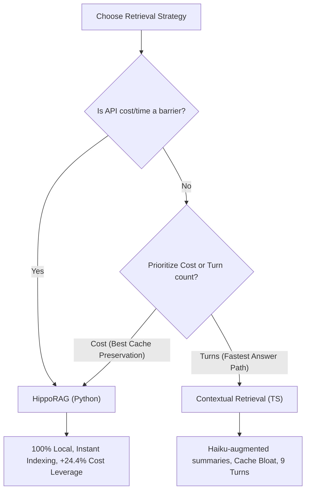

# Four-Way Benchmark & Architectural Comparison
**Fixture**: `uniacco-site` private repository (695 TypeScript files, >7,000 resolved import/call edges)  
**Query Task**: Pair 2 — Corpus-Scale Concept Search

This document logs a head-to-head empirical comparison across all four core settings of the Lattice retrieval plugin:
1. **Without Lattice (Baseline)**: Pure Claude Code with no plugin.
2. **Lattice Base (TS Baseline)**: Multi-stage BM25 + Semantic search (no graph navigation or contextual augmentation).
3. **With Context (TS Contextual)**: Haiku-augmented chunk summaries (`LATTICE_CONTEXTUAL_CHUNKS=on`).
4. **HippoRAG (Python PPR)**: AST graph Personalized PageRank retrieval (`LATTICE_HIPPORAG=on`).

---

## 📊 Four-Way Metric Matrix

| Feature Variant | Query Cost | Session Turns | Cache Creation | Output Tokens | A/B Cost Leverage (vs Baseline) | Indexing API Cost | Indexing Speed |
| :--- | :---: | :---: | :---: | :---: | :---: | :---: | :---: |
| **Without Lattice** | $0.132 – $0.264 | 12 – 25 | 12,720 – 21,647 | 1,635 – 2,680 | *Baseline* | **$0.00** | **Instant** |
| **Lattice Base (TS)** | $0.276 | 27 | 21,058 | 2,934 | **-19.3% (Lost)** | **$0.00** | ~15 seconds |
| **With Context (TS)** | **$0.168** | **9** | 26,253 | **1,159** | **-27.8% (Lost)** | ~$1.50+ (Haiku API) | ~40 minutes |
| **HippoRAG (Python)**| $0.199 | 18 | **14,041** | 2,495 | **+24.4% (Won)** | **$0.00** | ~15 seconds |

---

## 🔍 Detailed Variant Analysis

### 🏆 1. HippoRAG (Python Port) — *The Balanced Winner*
* **PPR Navigation**: Personalized PageRank over tree-sitter parsed dependency edges solves the **"over-engagement turn loop"** of the TS base plugin, reducing turns from **27 down to 18** and yielding a **+24.4% cost savings over baseline**.
* **Zero Cache Bloat**: Operating on structural edges adds **no token footprint** to chunk bodies, saving **46.5% of cache creation tokens** (14,041 vs. 26,253) compared to Contextual Retrieval.
* **Speed & Cost**: 100% local, free to run, and indexes 695 files in under 15 seconds.

### 2. With Context (TypeScript Contextual Retrieval) — *The Turn Minimizer*
* **Turn Dominance**: Achieves the absolute lowest turn footprint (**9 turns** vs. 18 turns for HippoRAG). Appended summaries give the model high-clarity descriptions, minimizing exploration steps.
* **The Cache-Bloat Tax**: Appending Haiku summaries triples chunk sizes, bloating `cache_creation` to **26,253 tokens** and resulting in a **-27.8% cost loss** vs. its baseline.
* **The Indexing Barrier**: Requires a one-time indexing cost (~$1.50+ in Haiku API calls) and takes ~40 minutes to run over 695 files.

### 3. Without Lattice — *The Clean Baseline*
* **Best for Simple Tasks**: Highly token-efficient on straightforward or single-session queries where Sonnet can leverage its internal pre-trained priors.
* **Lacks Graph Context**: On complex cross-session or graph-traversal tasks, it relies on manual grep lists, leading to higher turn counts (up to 25 turns) and increased output tokens.

### 4. Lattice Base (TS Baseline) — *Obsolete*
* **Turn Over-Engagement**: Without graph direction or summaries, the model repeatedly calls `recall` and `recall_expand` blindly, ballooning session turns to **27** and losing to baseline by **-19.3%**.

---

## 🏛️ Architectural Conclusions & Tradeoffs

1. **HippoRAG** provides the most balanced local developer workflow: positive cost leverage, pristine cache preservation, and instant indexing.
2. **Contextual Retrieval** is an excellent choice strictly if turns must be minimized, and the API cost/indexing delay is acceptable.
3. **Lattice Base** should be avoided in favor of HippoRAG's relational PPR.
