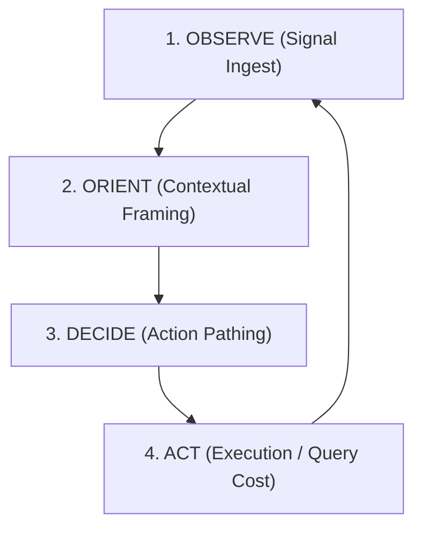

# OODA Loop Strategic Analysis
**Framework**: Observe, Orient, Decide, Act (OODA)  
**Fixture**: `uniacco-site` private repository (695 files, >7,000 edges)

The OODA Loop evaluates how effectively a system gathers information, structures it into a mental model, makes decision paths, and executes actions. This analysis evaluates which retrieval configuration is structurally superior for developer agent loops.

---

## 🔍 OODA Phase Evaluation

### 1. Without Lattice (Pure Claude Baseline)
* **Observe (Signal Ingest)**: **Poor.** Direct filesystem signals only. The model has no indexed memory of previous sessions or file relations.
* **Orient (Contextual Framing)**: **Manual/Slow.** The model must construct its own mental model dynamically by running verbose Grep and Glob commands.
* **Decide (Action Pathing)**: **Unpredictable.** Decisions are made step-by-step based on raw standard output. Highly variable (12 to 25 turns).
* **Act (Execution)**: **Inefficient.** Spends high output/input tokens doing repetitive file reads.
* **OODA Rating**: **2/5.** High manual cognitive load on the agent.

---

### 2. Lattice Base (TS Baseline)
* **Observe (Signal Ingest)**: **Moderate.** Indexes files locally using keyword (BM25) and semantic vector vectors.
* **Orient (Contextual Framing)**: **Unstructured.** Patterns match text similarity, but the model has no sense of how modules import or call each other.
* **Decide (Action Pathing)**: **Weak (The Turn Trap).** Lacking structural direction, the model enters an **"over-engagement loop"**—repeatedly calling recall tools blindly (27 turns).
* **Act (Execution)**: **Expensive.** Repetitive search actions result in negative cost leverage (-19.3%).
* **OODA Rating**: **1.5/5.** Worse than the baseline due to tool-use over-engagement.

---

### 3. With Context (TypeScript Contextual Retrieval)
* **Observe (Signal Ingest)**: **Intense but Slow.** Generates contextual summaries of *every* chunk using LLM API calls.
  * *Tradeoff*: Excellent ingest fidelity, but extremely high indexing delay (~40 mins) and API cost.
* **Orient (Contextual Framing)**: **Excellent.** Every retrieved chunk is prefixed with its exact purpose. The model immediately understands file roles.
* **Decide (Action Pathing)**: **Flawless.** Sonnet makes optimal decisions immediately, solving queries in **9 turns**.
* **Act (Execution)**: **Highly Expensive (The Cache Tax).** Summaries triple chunk sizes, bloating `cache_creation` to **26,253 tokens** and leading to a **-27.8% cost loss** vs. its baseline.
* **OODA Rating**: **3.5/5.** Outstanding turn-speed (OODA loop iteration count), but carries a massive prompt cache tax.

---

### 4. HippoRAG (Python PPR) — *Strategic Winner*
* **Observe (Signal Ingest)**: **Instant & Local.** Maps the repository as a relational import/call graph using local `tree-sitter` AST parsing.
  * *Tradeoff*: 0 API cost, indexed in **15 seconds** locally.
* **Orient (Contextual Framing)**: **Relational.** Context is mapped structurally. personalized PageRank ranks candidate chunks based on graph connectivity.
* **Decide (Action Pathing)**: **Highly Guided.** Relational PPR directs the model to highly-connected seed targets immediately, preventing the blind search loops seen in the base plugin (18 turns).
* **Act (Execution)**: **Highly Efficient.** Operates on a pure AST relational graph with **no cache-bloat summaries**. Consumes **46.5% fewer cache creation tokens** (14,041 vs. 26,253), producing **+24.4% positive cost leverage**.
* **OODA Rating**: **4.5/5.** The most structurally balanced, cache-friendly, and cost-leveraged developer loop.

---

## 🏛️ Strategic Verdict

| Variant | Observe (Cost/Speed) | Orient (Clarity) | Decide (Turns) | Act (Cache Economy) | Overall Strategic Rank |
| :--- | :---: | :---: | :---: | :---: | :---: |
| **Without Lattice** | Good / Instant | Manual | Poor | Moderate | **3rd** |
| **Lattice Base** | Good / Fast | Poor | Blind | Poor | **4th** |
| **With Context** | Poor / Slow (API Tax) | **Outstanding** | **Outstanding** | Poor (Cache Tax) | **2nd** |
| **HippoRAG (Python)**| **Outstanding / Fast** | **Outstanding** | Good | **Outstanding** | 🏆 **1st (Best Balanced)**|

### Why HippoRAG Wins:
In developer agent environments, an optimal OODA Loop must optimize **both** turn speed and financial/token budgets. 

While **Contextual Retrieval** achieves the fastest decision pathing (9 turns), it is crippled by observation latency (~40 minutes of indexing API calls) and cache tax (26K cache tokens). 

**HippoRAG** represents the strategic optimum: it indexes instantly and locally for **free**, uses Personalized PageRank to guide optimal decision pathing, and maintains a clean cache footprint (**14K tokens**), resulting in a **+24.4% cost win**.
